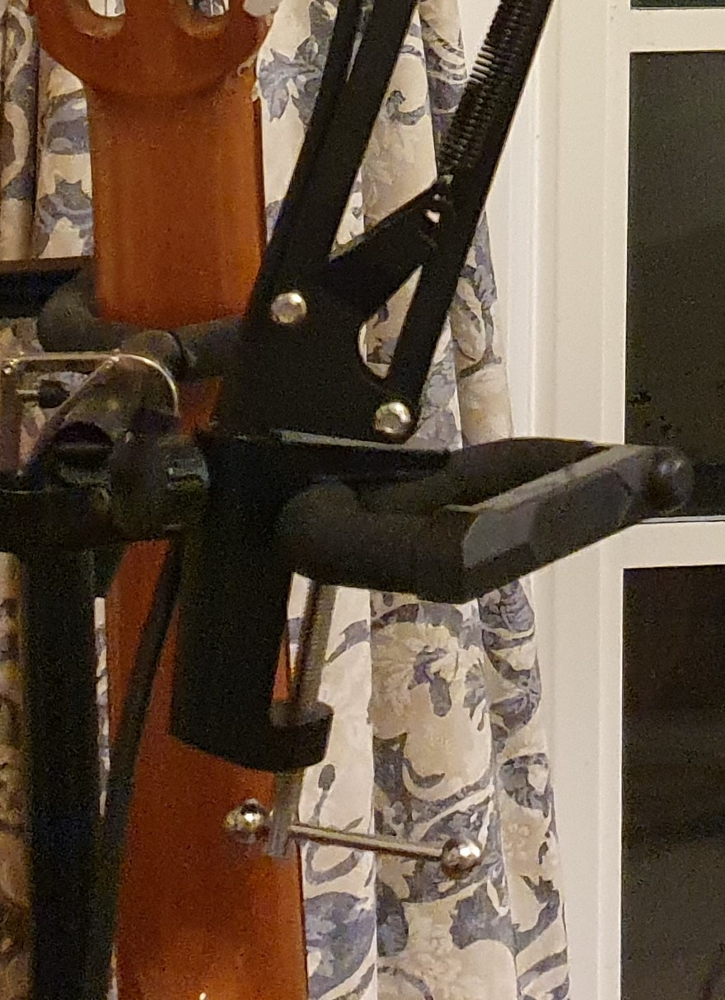

I wrote and produced my first original song! Well, the first that is going to
see the light of day, anyway.

Have a listen:

 
<iframe
  title="&quot;Autumn Wind&quot;"
  src="https://dalek.zone/videos/embed/3f6a49e8-22b9-4db3-bfd7-05c6c415f73b"
  allowfullscreen="" sandbox="allow-same-origin allow-scripts allow-popups"
  frameborder="0" style="min-width: 100%; max-width: 100%; aspect-ratio: 16/9"></iframe>

I won't be making a blog post for every new piece of music, so if you want to
keep getting musical updates, the best way is to [subscribe to this RSS
feed](https://tim.clifford.lol/music/rss.xml) or just keep an eye on
[https://tim.clifford.lol/music](https://tim.clifford.lol/music/).

## Producing music is harder than I thought

Trying to make music on your own requires doing several jobs, and I'm only
half-decent at one of them. Sure, I can perform, but writing music, recording
music, editing, mixing audio, and mastering audio are all surprisingly complex
tasks which I have next to zero experience in. So go easy on me!

## The creative process

This experience has taught me that creative endeavours do not obey the first
law of thermodynamics, i.e. the conservation of energy. (Why should they?
They're not thermodynamical systems). In other words, work in ≠ quality out.
Case in point: "Autumn Wind" is actually the *second* song which I've got
pretty far through writing. The first I started writing back in the summer,
several months ago, and I'm *still* not happy with it, even after all this
time. "Autumn Wind", on the other hand? I pretty much wrote it in a single day,
and I'm much more happy with it. ????! Ok, sure, I had been noodling[^noodle]
around with like, half of the guitar part for a while, but the rest all got
written in that one day.

[^noodle]: [*noodle, noodled,
noodling*](https://www.merriam-webster.com/dictionary/noodle) (verb): to
improvise on an instrument in an informal or desultory manner

I wish I could say something interesting about the process I went through to
write "Autumn Wind", but my brain just sort of splatted it out from nowhere.
First I had the fingerstyle guitar part that I had been noodling on, then I
started humming a melody, and the lyrics just kind of appeared in my head,
though there were a few revisions. The one interesting lesson is that sometimes
the best writing happens by accident - you go for one chord, but your hand is
in the wrong place, and you get an accidental but exciting chord instead. I
think sometimes I can fall into a bit of a rut and it takes a little randomness
to send me in a new and exciting direction.

## A pretty janky recording setup

Would you expect anything less? Here are some highlights:

<table style="width: 100%"><tr><td style="width: 69%">
<figure>
 
 <figcaption aria-hidden="true" style="width: 80%; margin: auto">
   The world's most secure mic stand attachment 
   (yes, indeed, the entire cantilever is clamped onto a squishy guitar holder)
 </figcaption>
</figure>

</td><td>

<figure style="float: right;">
 
 <figcaption aria-hidden="true">
   The world's most stable camera setup, featuring terrible picture quality
 </figcaption>
</figure>
</td></tr></table>

Also, ground loops suck (and analog electronics in general sucks). I wanted to
record the guitar both directly and through a physical amp, but without an
isolated buffer splitter on the guitar output -- which is expensive to buy or
time consuming to build -- connecting to two outputs creates a horrible ground
loop between between the two devices, which just kills the audio quality. Oh
well.

## Wait, Linux is actually great for realtime audio?

It appears audio engineering, at least the realtime part, is different from
most other creative professions, in that you actually can have a good time
doing it on Linux[^linux]. Yay! It makes sense I guess, I mean, have fun trying
to get decent latency on Windows when your processor is being hammered by
background spyware. Or getting your kernel to do anything in realtime, for that
matter.

[^linux]: Which isn't really anything to do with Linux, it's more to do with
companies like Adobe managing to gain a stranglehold.

You'll hear a lot of people saying "only macOS is usable for audio
engineering", but obviously this is bullshit. What they actually mean is that
their favourite programs don't run on Linux. Linux's audio subsystems are
easily on par with macOS's: in particular JACK (the JACK Audio Connection Kit)
is awesome and versatile and pretty intuitive to work with. As for the rest of
the software stack, well, it seems most filters and other processing plugins
work on interoperable standards, i.e., on any operating system. There are some
proprietary things which are hard to replicate on Linux, e.g., automatic pitch
correction (autotune), but I'd rather just sing approximately in-tune in the
first place lol.

## Mixing? Idk

The internet told me that a little reverb makes things sound better, and I
think my ears agree. Other than that, I honestly have no clue. I think it
sounds okay, but I'd have a much harder time if there were more tracks than
just guitar and voice. Actually my recording setup makes it more difficult than
it should be, because the guitar audio spills into the microphone audio and
makes it a lot harder to edit and mix e.g. to patch over a tiny guitar fumble.
I *could* just record each track independently, but then the video would either
be lip-synced or whatever the guitar equivalent is called or both, which I
wouldn't really vibe with.

## Mastering is hard

Until quite recently I didn't even understand what mastering was. Apparently,
the idea is to maximise the apparent loudness of the track, which can be quite
low without some work, because the track has to be normalised to its highest
peak (usually much higher than the average peak). When mastering, you're trying
to eliminate these peaks so that you can renormalise the track to a higher
gain. Basically you do this using compressors (which compress the dynamic range
above a certain level) and other peak thresholding magic which sounds better
than just clipping the audio. It's hard, and the confusing thing is that a good
master is inverse to a performer's instinct to use a wide dynamic range for
musical effect. To be honest I don't really get it. My guess is that "quiet"
bits aren't actually meant to be quiet, they're meant to seem quieter because
of the different timbre etc.

You'll notice that my recording is a little quieter than other music if you
listen to them side by side. That's because I'm bad at mastering :P

<!-- vi: set sts=2 sw=2 et :-->
